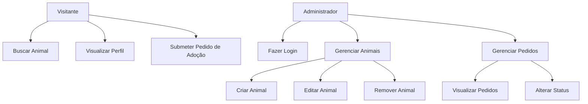
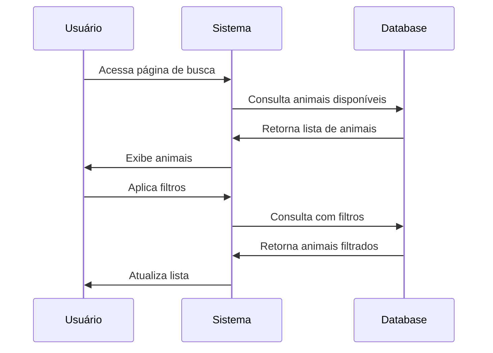

# ESPECIFICAÇÃO DO PROJETO ADOTAPET

---

## CAPA

**Projeto:** AdotaPet - Plataforma de Adoção de Animais  
**Versão:** 1.0  
**Data:** Janeiro 2025  
**Responsável:** Equipe de Desenvolvimento  

---

## SUMÁRIO

1. [Introdução](#1-introdução)
2. [Stakeholders](#2-stakeholders)  
3. [Objetivos Funcionais](#3-objetivos-funcionais)
4. [Objetivos Não-Funcionais](#4-objetivos-não-funcionais)
5. [Casos de Uso](#5-casos-de-uso)
6. [Protótipos de Tela](#6-protótipos-de-tela)
7. [Arquitetura e Modelagem](#7-arquitetura-e-modelagem)
8. [Conteúdo Fictício](#8-conteúdo-fictício)

---

## 1. INTRODUÇÃO

O **AdotaPet** é uma plataforma web desenvolvida para facilitar o processo de adoção de animais domésticos, conectando abrigos, ONGs e pessoas interessadas em adotar pets. O sistema oferece uma interface intuitiva e funcionalidades completas para gerenciamento de perfis de animais e solicitações de adoção.

### 1.1 Título do Projeto
**AdotaPet** - Conectando corações, salvando vidas.

---

## 2. STAKEHOLDERS

### 2.1 Administradores/Funcionários de Abrigos
- **Descrição:** Pessoas responsáveis por gerenciar os perfis dos animais disponíveis para adoção
- **Necessidades:** Criar, editar e remover perfis de animais; gerenciar solicitações de adoção
- **Benefícios:** Maior visibilidade dos animais; processo de adoção mais organizado

### 2.2 Adotantes em Potencial  
- **Descrição:** Usuários que visitam o site para encontrar um animal de estimação
- **Necessidades:** Buscar animais por critérios específicos; visualizar informações detalhadas; solicitar adoção
- **Benefícios:** Facilidade para encontrar o pet ideal; processo de adoção simplificado

### 2.3 Animais
- **Descrição:** O foco principal do sistema
- **Necessidades:** Ter suas informações exibidas de forma clara e atrativa para aumentar chances de adoção
- **Benefícios:** Maior exposição e possibilidade de encontrar uma família

---

## 3. OBJETIVOS FUNCIONAIS

### 3.1 Gerenciamento de Animais
- Criar perfis completos de animais (fotos, descrição, espécie, idade, raça, etc.)
- Editar informações de animais existentes
- Remover animais do sistema quando adotados
- Upload de múltiplas fotos por animal

### 3.2 Busca e Filtragem
- Busca por nome do animal
- Filtros por espécie (cão, gato, outros)
- Filtros por raça, idade, porte
- Filtros por localização/região
- Ordenação por data de cadastro, idade, nome

### 3.3 Visualização de Perfil
- Página detalhada de cada animal
- Galeria de fotos
- História e características do animal
- Informações sobre saúde e temperamento
- Dados de contato do abrigo responsável

### 3.4 Processo de Adoção
- Formulário de interesse em adoção
- Coleta de dados do adotante
- Sistema de envio de solicitações
- Página de confirmação de envio

### 3.5 Dashboard do Administrador
- Login seguro para administradores
- Visualização de todos os pedidos de adoção
- Gerenciamento de status dos pedidos
- Relatórios e estatísticas

---

## 4. OBJETIVOS NÃO-FUNCIONAIS

### 4.1 Usabilidade
- Interface intuitiva e fácil de usar
- Design responsivo para todos os dispositivos
- Navegação clara e consistente
- Tempo de aprendizado mínimo

### 4.2 Desempenho
- Carregamento de páginas em menos de 3 segundos
- Otimização de imagens
- Cache eficiente
- Suporte a múltiplos usuários simultâneos

### 4.3 Segurança
- Proteção de dados pessoais
- Validação de formulários
- Prevenção contra ataques comuns
- Backup regular dos dados

### 4.4 Compatibilidade
- Funcionamento em Chrome, Firefox, Safari, Edge
- Responsividade para dispositivos móveis
- Acessibilidade conforme WCAG 2.1

---

## 5. CASOS DE USO

### 5.1 Diagrama de Casos de Uso



### 5.2 Fluxo "Buscar Animal"

**Ator:** Visitante  
**Pré-condições:** Nenhuma  
**Fluxo Principal:**
1. Usuário acessa a página de busca
2. Sistema exibe lista de animais disponíveis
3. Usuário aplica filtros desejados
4. Sistema atualiza resultados conforme filtros
5. Usuário visualiza animais filtrados

**Fluxos Alternativos:**
- 4a. Nenhum animal encontrado: sistema exibe mensagem informativa

### 5.3 Fluxo "Submeter Pedido de Adoção"

**Ator:** Adotante em Potencial  
**Pré-condições:** Ter selecionado um animal  
**Fluxo Principal:**
1. Usuário clica em "Quero Adotar"
2. Sistema exibe formulário de adoção
3. Usuário preenche dados pessoais
4. Usuário envia formulário
5. Sistema confirma recebimento

### 5.4 Fluxo "Gerenciar Animais"

**Ator:** Administrador  
**Pré-condições:** Estar logado  
**Fluxo Principal:**
1. Admin acessa dashboard
2. Sistema exibe lista de animais
3. Admin seleciona ação (criar/editar/remover)
4. Sistema processa solicitação
5. Sistema confirma alteração

---

## 6. PROTÓTIPOS DE TELA

### 6.1 Homepage
- Header com logo e navegação
- Hero section com call-to-action
- Seção "Destaques da Semana" com 3 animais
- Estatísticas de adoções
- Footer com informações de contato

### 6.2 Página de Resultados de Busca
- Barra de filtros lateral
- Grid de cards com animais
- Paginação
- Ordenação

### 6.3 Página de Perfil do Animal
- Galeria de fotos principal
- Informações básicas (nome, idade, porte)
- Descrição detalhada
- Características (vacinado, castrado)
- Botão "Quero Adotar"
- Informações do abrigo

### 6.4 Formulário de Adoção
- Campos de dados pessoais
- Informações sobre moradia
- Experiência com pets
- Botão de envio

---

## 7. ARQUITETURA E MODELAGEM

### 7.1 Modelo de Domínio

**Entidades Principais:**
- **Animal:** id, nome, espécie, raça, idade, porte, descrição, fotos, vacinado, castrado, abrigo_id
- **Abrigo:** id, nome, endereço, telefone, email
- **Pedido_Adocao:** id, animal_id, nome_adotante, email, telefone, data_pedido, status
- **Administrador:** id, username, password, abrigo_id

### 7.2 Diagrama de Classes

```mermaid
classDiagram
    class Animal {
        +id: UUID
        +nome: String
        +especie: String
        +raca: String
        +idade: String
        +porte: String
        +descricao: Text
        +fotos: Array
        +vacinado: Boolean
        +castrado: Boolean
        +abrigo_id: UUID
    }
    
    class Abrigo {
        +id: UUID
        +nome: String
        +endereco: String
        +telefone: String
        +email: String
    }
    
    class PedidoAdocao {
        +id: UUID
        +animal_id: UUID
        +nome_adotante: String
        +email: String
        +telefone: String
        +data_pedido: Date
        +status: String
    }
    
    Abrigo ||--o{ Animal : possui
    Animal ||--o{ PedidoAdocao : recebe
```

### 7.3 Diagrama de Sequência - Buscar Animal



---

## 8. CONTEÚDO FICTÍCIO

### 8.1 Destaques da Semana
1. **Buddy** - "Um coração gigante em um corpo peludo"
2. **Luna** - "Elegância felina em busca de carinho"
3. **Max** - "Inteligência e lealdade em um só pacote"

### 8.2 Galeria de 20 Animais Fictícios

**Cães:**
1. Buddy - Golden Retriever, 2 anos
2. Max - Border Collie, 3 anos
3. Bella - Labrador, 4 anos
4. Thor - Pastor Alemão, 5 anos
5. Nina - Poodle, 1 ano
6. Rex - Rottweiler, 6 anos
7. Mel - Beagle, 2 anos
8. Zeus - Husky Siberiano, 3 anos
9. Maya - Bulldog Francês, 2 anos
10. Duke - Boxer, 4 anos

**Gatos:**
11. Luna - Siamês, 1 ano
12. Mimi - Persa, 6 meses
13. Salem - Preto, 2 anos
14. Snow - Branco, 3 anos
15. Tiger - Tigrado, 1 ano
16. Princess - Angorá, 4 anos
17. Shadow - Cinza, 2 anos
18. Ginger - Laranja, 1 ano
19. Whiskers - Maine Coon, 5 anos
20. Patches - Tricolor, 3 anos

### 8.3 Histórias Detalhadas dos Animais

Cada animal terá uma história única e envolvente, incluindo:
- Como chegou ao abrigo
- Personalidade e temperamento
- Características especiais
- Compatibilidade (crianças, outros pets)
- Necessidades específicas

### 8.4 Pedidos de Adoção Fictícios

10 pedidos com dados realistas:
- Nomes dos adotantes
- Animais escolhidos
- Status variados (Pendente, Em Análise, Aprovado, Rejeitado)
- Datas de solicitação

---

## CONSIDERAÇÕES FINAIS

Este documento serve como guia completo para o desenvolvimento do AdotaPet, garantindo que todas as funcionalidades sejam implementadas conforme especificado e que o sistema atenda às necessidades de todos os stakeholders envolvidos.